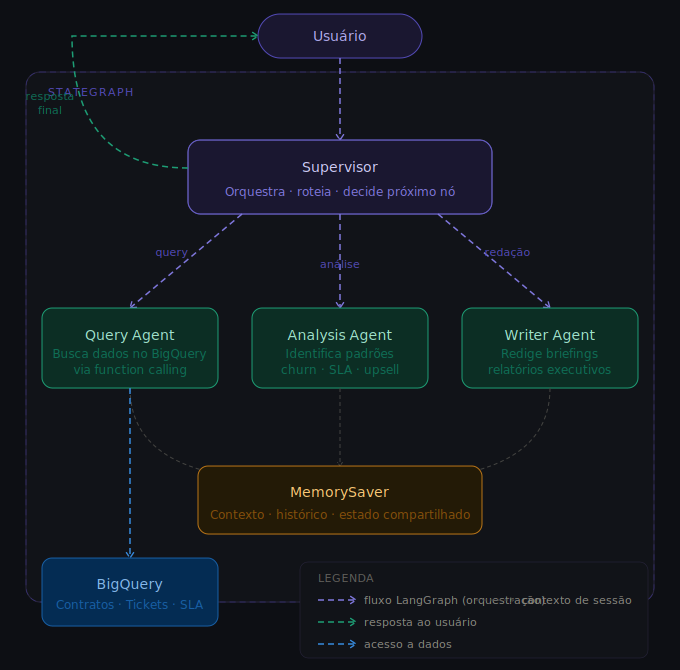

# Datalyx Client Intelligence


> Sistema **multiagente** de inteligência de carteira de clientes. Faça perguntas em linguagem natural sobre contratos, tickets e SLA e receba análises executivas geradas por uma pipeline de agentes especializados conectada ao BigQuery.

---

## Demo

> **Pergunta:** *"Quais clientes estão em situação crítica?"*

<!-- Adicione aqui um GIF gravado com OBS/ScreenToGif -->
<!--  -->

*▶ GIF em breve. Grave com [ScreenToGif](https://www.screentogif.com/) e salve em `assets/demo.gif`*

---

## Antes vs. Depois

| Antes | Depois |
|---|---|
| Abrir BigQuery Console | Fazer uma pergunta em português |
| Escrever SQL manualmente | Agente busca, analisa e responde |
| Interpretar linhas de tabela | Receber briefing executivo pronto |
| Processo repetido a cada reunião | Contexto mantido entre perguntas |

```sql
-- Antes: consulta manual para cada análise
SELECT cliente, COUNT(*) as tickets, AVG(tempo_resposta_horas) as sla_medio
FROM datalyx_analytics.sla_metricas s
JOIN datalyx_analytics.tickets t ON s.ticket_id = t.id
WHERE t.categoria = 'incidente' AND t.prioridade = 'alta'
GROUP BY cliente ORDER BY tickets DESC;
```

```
-- Depois: uma pergunta em linguagem natural
"Quais clientes têm mais incidentes críticos com SLA estourado?"

→ Supervisor roteia → Query Agent busca → Analysis Agent analisa
→ Writer Agent entrega briefing executivo em segundos
```

---

## Arquitetura



> 🔗 [Versão interativa com animações](assets/architecture.html)

### Agentes

| Agente | Responsabilidade |
|---|---|
| **🎯 Supervisor** | Lê o estado atual e decide qual agente chamar a seguir |
| **🔍 Query Agent** | Chama ferramentas BigQuery com function calling nativo do Gemini |
| **🧠 Analysis Agent** | Identifica riscos de churn, SLA estourado e oportunidades de upsell |
| **✍️ Writer Agent** | Transforma a análise em briefing executivo com tom direto |
| **💾 MemorySaver** | Checkpointer do LangGraph, mantém contexto entre perguntas da sessão |

---

## Dados (BigQuery: `datalyx_analytics`)

| Tabela | Registros | Descrição |
|---|---|---|
| `contratos` | 10 clientes | Modelo (Radar/Forja/Nexus), valor mensal, horas do pacote, status |
| `tickets` | ~370 tickets | Categoria (incidente/duvida/manutencao/fora_de_escopo), prioridade, cliente |
| `sla_metricas` | 1 por ticket | Tempo de resposta em horas, status de resolução |

**Modelos de contrato Datalyx:**
- **Radar**: pacote de horas avulso, menor comprometimento
- **Forja**: mensalidade com horas fixas, médio engajamento
- **Nexus**: contrato estratégico de alto valor, cliente fidelizado

---

## Stack técnica

```
LangGraph           → Orquestração do grafo multiagente com StateGraph + MemorySaver
google-generativeai → LLM calls direto (Gemini 2.5 Flash, function calling nativo)
BigQuery            → Fonte de dados real (3 tabelas, dataset datalyx_analytics)
Streamlit           → Interface web com dark theme e status dos agentes em tempo real
python-dotenv       → Gestão de credenciais via .env
```

**Por que `google-generativeai` direto e não `langchain-google-genai`?**
Chaves com prefixo `AQ.` (AI Studio) são incompatíveis com o wrapper LangChain. A lib nativa funciona perfeitamente e dá acesso completo ao function calling do Gemini.

---

## Estrutura do projeto

```
langgraph-client-intelligence/
├── app.py                  # Interface Streamlit
├── src/
│   ├── agent.py            # StateGraph: nós, arestas e compilação
│   ├── nodes.py            # Lógica de cada agente (Gemini + BigQuery)
│   ├── prompts.py          # System prompts dos 4 agentes
│   ├── state.py            # AgentState (TypedDict)
│   └── tools.py            # Tools LangChain (referência)
├── .env.example            # Template de variáveis de ambiente
├── requirements.txt
└── README.md
```

---

## Como rodar

### 1. Clonar e instalar

```bash
git clone https://github.com/wvanderlei/langgraph-client-intelligence.git
cd langgraph-client-intelligence
pip install -r requirements.txt
```

### 2. Configurar credenciais

```bash
cp .env.example .env
```

Edite o `.env`:

```env
GEMINI_API_KEY=sua_chave_do_ai_studio
GCP_PROJECT_ID=seu_projeto_com_bigquery
```

> **Autenticação GCP:** Execute `gcloud auth application-default login` para autenticar o BigQuery localmente.

### 3. Rodar

```bash
python -m streamlit run app.py
```

Acesse **http://localhost:8501**

---

## Exemplos de perguntas

```
"Quais clientes estão em situação crítica?"
"Qual cliente tem maior risco de churn?"
"Me dê um resumo executivo da carteira"
"Como está o SLA dos clientes Nexus?"
"Quais clientes têm oportunidade de upsell?"
"Me fala tudo sobre o MediFlow"
"Qual cliente gerou mais tickets de incidente esse mês?"
```

---

## Sobre

Projeto desenvolvido como parte do portfólio de **LLM & AI Engineering** da [Datalyx](https://datalyx.com.br).

Parte de uma trilha de 3 projetos:
1. ✅ [`llm-document-intelligence`](https://github.com/waydsonb/llm-document-intelligence) (processamento de documentos com Gemini)
2. ✅ **`langgraph-client-intelligence`** - você está aqui
3. 🔜 `llmops-monitoring` (observabilidade e monitoramento de LLMs em produção)
